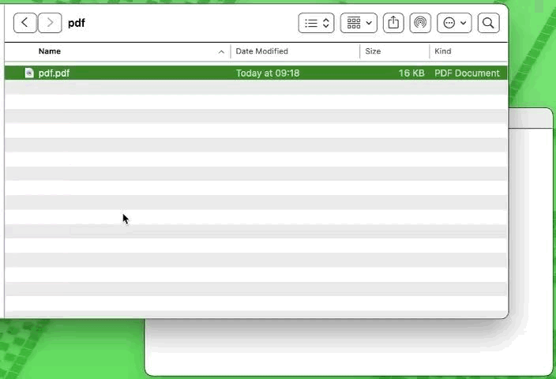

# pinv



Invert PDF colors from the command line.

## Install and Usage

- Install with npm/bun from the npm repository.

```sh
bun install -g pinv-cli
```

- Invert all PDFs in the current folder:
  ```
  pinv
  ```

  - Invert all PDFs in a folder:
  ```
  pinv path/to/folder
  ```

- Invert a specific PDF:
  ```
  pinv path/to/file.pdf
  ```
